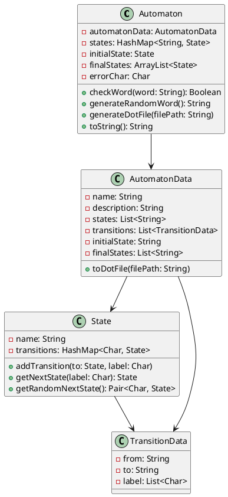

```plantuml
@startuml

class Automaton {
    - automatonData: AutomatonData
    - states: HashMap<String, State>
    - initialState: State
    - finalStates: ArrayList<State>
    - errorChar: Char
    + checkWord(word: String): Boolean
    + generateRandomWord(): String
    + generateDotFile(filePath: String)
    + toString(): String
}

class AutomatonData {
    - name: String
    - description: String
    - states: List<String>
    - transitions: List<TransitionData>
    - initialState: String
    - finalStates: List<String>
    + toDotFile(filePath: String)
}

class State {
    - name: String
    - transitions: HashMap<Char, State>
    + addTransition(to: State, label: Char)
    + getNextState(label: Char): State
    + getRandomNextState(): Pair<Char, State>
}

class TransitionData {
    - from: String
    - to: String
    - label: List<Char>
}

Automaton --> AutomatonData
AutomatonData --> State
AutomatonData --> TransitionData
State --> TransitionData

@enduml
```