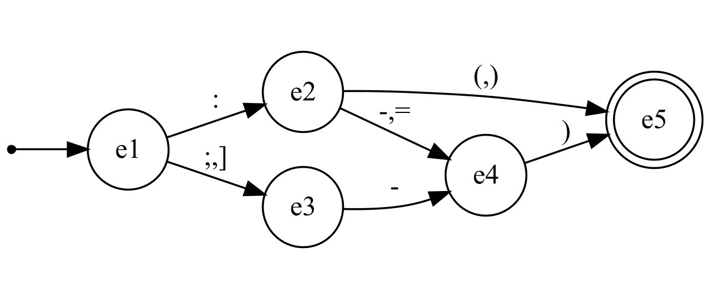

# Rapport TP Automates et Languages

**Nom**: Sacha Chauvel  
**Cours**: Automates et Languages  
**Date**: 13/02/2025  
**Université**: Nantes Université

## Introduction
Ce rapport présente le travail réalisé sur les automates dans le cadre du cours Automates et Languages. Un automate est un modèle mathématique utilisé pour représenter des systèmes avec des états et des transitions. Ce projet vise à développer une application permettant de vérifier des mots, générer des mots aléatoires et créer des fichiers DOT représentant les automates.

## Réalisation
### Analyseur/Accepteur
L'application développée permet de charger des automates définis dans des fichiers JSON, de vérifier si des mots sont acceptés par ces automates, de générer des mots aléatoires et de créer des fichiers DOT pour visualiser les automates.

#### Automates Encodés et Testés
- **Automate de test "abc"**: Utilisé pour valider l'utilsation du format json.
- **Automate de test "abcExtended"**: Utilisé pour valider le fonctionnement général de l'application.
- **Automate Smiley**: Vérifie les smiley tel que :-) ou ]=).
- **Automate heures (hhmm)**: Vérifie les heures au format `hh:mm`.
- **Automate de date (ddmmyyyy)**: Vérifie les dates au format `dd/mm/yyyy`.

#### Architecture Logicielle

L'application est organisée en plusieurs classes:
- **MonApplication**: Classe gérant l'interface utilisateur et les interactions avec l'automate.
- **Automaton**: Représente un automate, gère les états et les transitions.
- **State**: Représente un état de l'automate.
- **TransitionData**: Représente une transition entre deux états.

Les interactions entre ces classes permettent de charger les automates, de vérifier les mots, de générer des mots aléatoires et de créer des fichiers DOT.

### Utilisation comme Librairie (API)
L'application peut être utilisée comme une librairie pour créer et manipuler des automates. Les classes `Automaton`, `State` et `TransitionData` peuvent être réutilisées pour créer des automates personnalisés et vérifier des mots.

### Limitations
- **Mots à multiple caractère** : La version actuelle ne supporte pas les mots à multiple caractère, l'implémentation de l'automate de la "francette" est donc complexe sans modifications.
- **Format des dates**: L'automate de date ne gère pas les années bissextiles.
- **Interface utilisateur**: L'application est en ligne de commande, ce qui peut être moins intuitif pour certains utilisateurs.

## Conclusion
Ce travail a permis de développer une application fonctionnelle pour manipuler des automates. Les perspectives incluent l'amélioration de l'interface utilisateur et l'ajout de nouveaux types d'automates. Ce projet ouvre la voie à des applications plus complexes utilisant des automates pour la vérification et la génération de séquences.

## Références
- **Ouvrages**: Ressource R412 Automates et Languages
- **Sites**: [kotlinlang.org](https://kotlinlang.org/)
- **ChatGPT**: Utilisé pour générer des exemples de code pour l'interface ainsi que la correction de fautes d'orthographes.